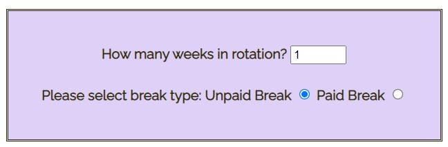
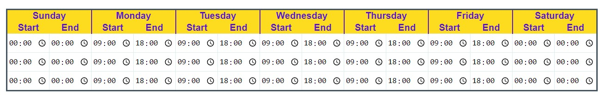
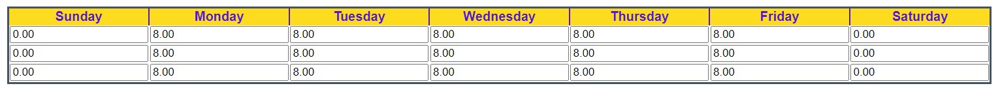
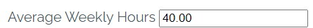

# Roster Calculator

The purposes of this website is to provide a roster calculator for medium to large size companies. The user will select the number of weeks and the table wil display prompting a start time and end end time for each day. The calculator is geared towards a paid hours calculation, so if the user selects unpaid breaks, these hours will be removed. 

With large scale companies, it is common to have mutiple rosters to cover all their internal teams and roles. These can be beome quite complex when tryng to match hours against changing busy periods or seasonal trends.

One of the mian considerations when creating a roster is to ensure the hours in the roster matches the employee contracted hours ob avger over the length of the roster (1 week or muttiple weeks). This calculator shows the use the average hours and they can then edit the times, if eeded, to bring the average to the 40 hours (or whatever contract the employee has)

## Features 

### Existing Features

__Selecter Number of Weeks and whether paid or unpaid breaks__
  - 
  - These are the first 2 user inputs needed. 
  - The number of weeks determines how many lines in the roster.
  - Paid or unpaid breaks will effect the calculation for shift length. This is beacuse the shift length that is being caluclated is paid hours. This should match back to an employees contracted weekly hours.

__Enter Daily Start and End times__

  - 
  - The number of rows in this table will be based on the selection the user made in the above dropdown list.
  - This table allows for inputs for Start and End time for each day. 

__Display Daily shift lengths__

  - 
  - The number of rows in this table will maych the input table
  - This is a readonly table which displays the length of each shift for each day. This is in demimal format.

__Average Weekly Hours__

  - 
  - This is straight forward calculation of the total number of shifts hours divided by the number of weeks.
  - The average weekly hours are displayed as readonly
  - The average weekly hours should be a check against whatever contracted hours a particular mployee has

__Next Steps__
  - Although mobile first is the recomended approach, for this particular pfoject, the recoended viewing is on a tablet or above. The reason for this is that weekly view is needed. Further disign would be needed to optimise this site for mobiles with the lielihood being a day view for each day of the roser rather than a weekly view but this too would be probleatic on rosters longer than 2 or 3 weeks.

  - Also, most robost checks are needed to ensure user does not select a roster below zero length shift.

## Testing 

In this section, you need to convince the assessor that you have conducted enough testing to legitimately believe that the site works well. Essentially, in this part you will want to go over all of your project’s features and ensure that they all work as intended, with the project providing an easy and straightforward way for the users to achieve their goals.

In addition, you should mention in this section how your project looks and works on different browsers and screen sizes.

You should also mention in this section any interesting bugs or problems you discovered during your testing, even if you haven't addressed them yet.

If this section grows too long, you may want to split it off into a separate file and link to it from here.

### Validator Testing 

- HTML
    - No errors were returned when passing through the official [W3C validator](https://validator.w3.org/nu/?doc=https%3A%2F%2Fcode-institute-org.github.io%2Flove-maths%2F)
- CSS
    - No errors were found when passing through the official [(Jigsaw) validator](https://jigsaw.w3.org/css-validator/validator?uri=https%3A%2F%2Fvalidator.w3.org%2Fnu%2F%3Fdoc%3Dhttps%253A%252F%252Fcode-institute-org.github.io%252Flove-maths%252F&profile=css3svg&usermedium=all&warning=1&vextwarning=&lang=en)
- JavaScript
    - No errors were found when passing through the official [Jshint validator](https://jshint.com/)
      - The following metrics were returned: 
      - There are 11 functions in this file.
      - Function with the largest signature takes 2 arguments, while the median is 0.
      - Largest function has 10 statements in it, while the median is 3.
      - The most complex function has a cyclomatic complexity value of 4 while the median is 2.

### Unfixed Bugs

You will need to mention unfixed bugs and why they were not fixed. This section should include shortcomings of the frameworks or technologies used. Although time can be a big variable to consider, paucity of time and difficulty understanding implementation is not a valid reason to leave bugs unfixed. 

## Deployment

This section should describe the process you went through to deploy the project to a hosting platform (e.g. GitHub) 

- The site was deployed to GitHub pages. The steps to deploy are as follows: 
  - In the GitHub repository, navigate to the Settings tab 
  - From the source section drop-down menu, select the Master Branch
  - Once the master branch has been selected, the page will be automatically refreshed with a detailed ribbon display to indicate the successful deployment. 

The live link can be found here - https://code-institute-org.github.io/love-maths/

## Credits 

In this section you need to reference where you got your content, media and extra help from. It is common practice to use code from other repositories and tutorials, however, it is important to be very specific about these sources to avoid plagiarism. 

You can break the credits section up into Content and Media, depending on what you have included in your project. 

### Content 

- The text for the Home page was taken from Wikipedia Article A
- Instructions on how to implement form validation on the Sign Up page was taken from [Specific YouTube Tutorial](https://www.youtube.com/)
- The icons in the footer were taken from [Font Awesome](https://fontawesome.com/)

### Media

- The photos used on the home and sign up page are from This Open Source site
- The images used for the gallery page were taken from this other open source site

Congratulations on completing your Readme, you have made another big stride in the direction of being a developer! 

## Other General Project Advice

Below you will find a couple of extra tips that may be helpful when completing your project. Remember that each of these projects will become part of your final portfolio so it’s important to allow enough time to showcase your best work! 

- One of the most basic elements of keeping a healthy commit history is with the commit message. When getting started with your project, read through [this article](https://chris.beams.io/posts/git-commit/) by Chris Beams on How to Write  a Git Commit Message 
  - Make sure to keep the messages in the imperative mood 

- When naming the files in your project directory, make sure to consider meaningful naming of files, point to specific names and sections of content.
  - For example, instead of naming an image used ‘image1.png’ consider naming it ‘landing_page_img.png’. This will ensure that there are clear file paths kept. 

- Do some extra research on good and bad coding practices, there are a handful of useful articles to read, consider reviewing the following list when getting started:
  - [Writing Your Best Code](https://learn.shayhowe.com/html-css/writing-your-best-code/)
  - [HTML & CSS Coding Best Practices](https://medium.com/@inceptiondj.info/html-css-coding-best-practice-fadb9870a00f)
  - [Google HTML/CSS Style Guide](https://google.github.io/styleguide/htmlcssguide.html#General)

Getting started with your Portfolio Projects can be daunting, planning your project can make it a lot easier to tackle, take small steps to reach the final outcome and enjoy the process! 